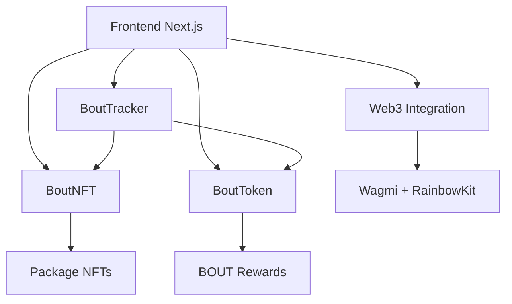

# BOUT System 🍾♻️

Un système de consigne décentralisé basé sur la blockchain Ethereum qui récompense le retour de bouteilles vides avec des tokens BOUT.

## 📋 Table des matières

- [Vue d'ensemble](#vue-densemble)
- [Architecture](#architecture)
- [Fonctionnalités](#fonctionnalités)
- [Installation](#installation)
- [Déploiement](#déploiement)
- [Usage](#usage)
- [Tests](#tests)
- [Sécurité](#sécurité)
- [Contribution](#contribution)

## 🌟 Vue d'ensemble

BOUT System est une solution blockchain innovante qui digitalise le système traditionnel de consigne. Le projet utilise des NFTs pour représenter les packages de bouteilles et récompense les utilisateurs avec des tokens ERC20 pour leurs actions écologiques.

### Objectifs
- 🌱 Encourager le recyclage et la réutilisation des bouteilles
- 💰 Récompenser les comportements écologiques
- 📊 Tracer de manière transparente le cycle de vie des bouteilles
- 🤝 Créer un écosystème décentralisé entre fournisseurs et consommateurs

## 🏗️ Architecture

Le système est composé de 3 smart contracts principaux et d'une interface web moderne :



### Contracts

#### 1. **BoutTracker** - Contrat Principal
- Gestion des rôles (Fournisseurs/Consommateurs)
- Logique métier du système de consigne
- Calcul et distribution des récompenses
- Statistiques globales

#### 2. **BoutNFT** - NFTs des Packages
- NFTs ERC721 représentant les packages de bouteilles
- Suivi du statut : SENT → RECEIVED → RETURNED → CONFIRMED
- Gestion des packages actifs/archivés
- Système de bannissement

#### 3. **BoutToken** - Token de Récompense
- Token ERC20 burnable pour les récompenses
- Minting uniquement via BoutTracker
- Représente la valeur écologique créée

### Frontend - Interface Web

#### **Stack Technique**
- **Next.js 14** - Framework React avec App Router
- **TypeScript** - Typage statique pour la robustesse
- **Wagmi v2** - Hooks React pour l'intégration Web3
- **RainbowKit** - Interface de connexion wallet
- **Tailwind CSS** - Styling moderne et responsive
- **Viem** - Client Ethereum léger et performant

#### **Architecture Frontend**
```
src/
├── app/                    # Pages Next.js (App Router)
│   ├── page.tsx           # Page principale BOUT System
│   ├── stats/             # Page de statistiques
│   └── layout.tsx         # Layout global
├── components/
│   ├── shared/            # Composants métier
│   │   ├── BoutSystem.tsx        # Composant principal
│   │   ├── RegisterUserForm.tsx  # Inscription utilisateur
│   │   ├── CreatePackage.tsx     # Création packages
│   │   ├── ReceivePackage.tsx    # Réception packages
│   │   ├── ReturnBottles.tsx     # Retour bouteilles
│   │   ├── ConfirmReturn.tsx     # Confirmation retours
│   │   ├── WithdrawTokens.tsx    # Retrait récompenses
│   │   ├── BoutPackageList.tsx   # Liste des packages
│   │   ├── BoutEvent.tsx         # Historique events
│   │   └── BoutStats.tsx         # Statistiques détaillées
│   └── hooks/             # Hooks personnalisés
│       └── usePublicClient.ts
└── constants.ts           # Configuration contracts & ABIs
```

## ✨ Fonctionnalités

### Pour les Fournisseurs
- ✅ Création de packages avec QR codes uniques
- ✅ Confirmation des retours de bouteilles
- ✅ Réception de bonus sur les retours confirmés
- ✅ Suivi des statistiques de performance

### Pour les Consommateurs
- ✅ Réception de packages via scan QR
- ✅ Déclaration des retours de bouteilles vides
- ✅ Récompenses en tokens BOUT
- ✅ Historique des packages reçus

### Pour les Administrateurs
- ✅ Configuration des taux de récompense
- ✅ Gestion des limites de packages actifs
- ✅ Bannissement de packages malveillants
- ✅ Mise à jour d'urgence des statuts

### Interface Web
- 🎨 **Dashboard intuitif** - Interface adaptée au rôle (Supplier/Consumer)
- 📊 **Statistiques en temps réel** - Suivi des performances et impact écologique
- 🔗 **Connexion Web3** - Intégration seamless avec les wallets
- 📱 **Design responsive** - Optimisé mobile et desktop
- ⚡ **Events en temps réel** - Historique des transactions blockchain
- 🎯 **UX optimisée** - Workflow guidé pour chaque action
- 🌙 **Multi-réseau** - Support Ethereum, Polygon, Sepolia

## 🛠️ Installation

### Prérequis
- [Foundry](https://getfoundry.sh/) pour le développement Solidity
- [Node.js 18+](https://nodejs.org/) pour le frontend Next.js
- [pnpm](https://pnpm.io/) comme gestionnaire de packages (recommandé)

### Setup Complet
```bash
# Cloner le repository
git clone https://github.com/votre-username/bout-system.git
cd bout-system

# === BACKEND (Contracts Solidity) ===
cd backend

# Installer Foundry si pas déjà fait
curl -L https://foundry.paradigm.xyz | bash
foundryup

# Installer les dépendances Foundry
forge install

# === FRONTEND (Interface Web) ===
cd ../frontend

# Installer les dépendances Node.js
pnpm install
# ou avec npm: npm install
# ou avec yarn: yarn install
```

### Variables d'Environnement

#### Backend (.env dans /backend)
```env
PRIVATE_KEY=your_private_key_here
SEPOLIA_RPC_URL=https://sepolia.infura.io/v3/your-project-id
POLYGON_RPC_URL=https://polygon-rpc.com
ETHERSCAN_API_KEY=your_etherscan_api_key
POLYGONSCAN_API_KEY=your_polygonscan_api_key
```

#### Frontend (.env.local dans /frontend)
```env
NEXT_PUBLIC_WALLETCONNECT_PROJECT_ID=your_walletconnect_project_id
NEXT_PUBLIC_ENABLE_TESTNETS=true
```

## 🚀 Déploiement

### Développement Local

#### 1. Lancer la Blockchain Locale + Contracts
```bash
cd backend

# Terminal 1: Démarrer Anvil (blockchain locale)
anvil

# Terminal 2: Déployer les contracts
forge script script/DeployBoutSystem.s.sol --rpc-url http://localhost:8545 --broadcast

# Compiler les contracts
forge build

# Lancer les tests
forge test
```

#### 2. Lancer le Frontend
```bash
cd frontend

# Démarrer en mode développement
pnpm dev
# ou: npm run dev

# L'application sera disponible sur http://localhost:3000
```

#### 3. Configuration Multi-Réseau
Le frontend supporte automatiquement :
- **Localhost (31337)** - Pour le développement
- **Sepolia (11155111)** - Testnet Ethereum  
- **Polygon Amoy (80002)** - Testnet Polygon

### Déploiement Production

#### Contracts (Testnet/Mainnet)
```bash
cd backend

# Exemple pour Sepolia
forge script script/DeployBoutSystem.s.sol \
  --rpc-url $SEPOLIA_RPC_URL \
  --broadcast \
  --verify

# Exemple pour Polygon
forge script script/DeployBoutSystem.s.sol \
  --rpc-url $POLYGON_RPC_URL \
  --broadcast \
  --verify
```

#### Frontend (Vercel/Netlify)
```bash
cd frontend

# Build de production
pnpm build

# Test du build localement
pnpm start

# Déploiement automatique via Git push (Vercel)
# ou upload du dossier .next/ (hébergement statique)
```

## 💡 Usage

### Via Interface Web (Recommandé)

#### 1. **Connexion Wallet**
- Visitez http://localhost:3000 (développement)
- Connectez votre wallet (MetaMask, WalletConnect, etc.)
- Le système détecte automatiquement le réseau

#### 2. **Inscription Utilisateur**
```typescript
// Interface automatique selon le rôle choisi
- Cliquer sur "S'inscrire comme Fournisseur" 
- Ou "S'inscrire comme Consommateur"
- Confirmer la transaction
```

#### 3. **Workflow Fournisseur**
```typescript
// 1. Création de package
const package = {
  bottleCount: 6,
  packageLink: "https://qr.code/unique-123",
  consumer: "0x742d35Cc6634C0532925a3b8D87b0d9a89C7b58a"
}

// 2. Suivi en temps réel
// - Dashboard avec packages actifs
// - Notifications de réception par le consommateur
// - Confirmations de retour à valider

// 3. Confirmation des retours
// - Validation des bouteilles retournées
// - Activation des récompenses automatiques
```

#### 4. **Workflow Consommateur**
```typescript
// 1. Réception via QR Code
// - Scanner ou saisir le lien du package
// - Validation automatique de l'assignation

// 2. Déclaration des retours
// - Interface simple pour déclarer le nombre de bouteilles
// - Calcul automatique des récompenses

// 3. Retrait des tokens
// - Un clic pour récupérer les BOUT tokens
// - Ajout automatique au wallet
```

#### 5. **Page Statistiques**
- **Métriques personnelles** : packages, bouteilles, récompenses
- **Impact écologique** : taux de retour, contribution environnementale  
- **Statistiques globales** : données système en temps réel
- **Historique complet** : tous les événements blockchain

### Via Smart Contracts (Développeurs)

#### Workflow Complet

1. **Enregistrement**
```solidity
// Fournisseur
boutTracker.registerAsSupplier();

// Consommateur  
boutTracker.registerAsConsumer();
```

2. **Création de Package**
```solidity
uint256 tokenId = boutTracker.createPackage(
    6, // Nombre de bouteilles
    "https://qr.code/unique", // Lien QR unique
    consumerAddress // Consommateur assigné
);
```

3. **Réception du Package**
```solidity
boutTracker.receivePackage("https://qr.code/unique");
```

4. **Retour des Bouteilles**
```solidity
boutTracker.returnBottles(tokenId, 5); // 5 bouteilles retournées
```

5. **Confirmation et Récompenses**
```solidity
// Fournisseur confirme
boutTracker.confirmReturn(tokenId);

// Retrait des récompenses
boutTracker.withdrawRewards();
```

### Configuration des Récompenses

```solidity
// 15 BOUT par bouteille retournée
boutTracker.setRewardPerBottle(15 * 1e18);

// 20% de bonus pour les fournisseurs
boutTracker.setSupplierBonusRate(20);
```

## 🧪 Tests

### Tests Smart Contracts (Foundry)

Le projet utilise Foundry pour les tests avec une couverture complète :

```bash
cd backend

# Lancer tous les tests
forge test

# Tests avec verbosité
forge test -vvvv

# Tests spécifiques
forge test --match-test testSupplierCanCreatePackage

# Couverture de code
forge coverage

# Tests avec gas reporting
forge test --gas-report
```

#### Suites de Tests
- ✅ Tests d'enregistrement des utilisateurs
- ✅ Tests de création et gestion des packages
- ✅ Tests du workflow complet de consigne
- ✅ Tests des récompenses et calculs
- ✅ Tests des fonctions administrateur
- ✅ Tests de sécurité et edge cases
- ✅ Tests fuzz pour la robustesse

### Tests Frontend

```bash
cd frontend

# Tests unitaires (si configurés)
pnpm test

# Tests E2E avec Playwright (à configurer)
pnpm test:e2e

# Linting et vérification types
pnpm lint
pnpm type-check

# Build de vérification
pnpm build
```

#### Validation Frontend
- ✅ **TypeScript** - Vérification des types à la compilation
- ✅ **ESLint** - Qualité et cohérence du code
- ✅ **Wagmi Hooks** - Gestion d'état Web3 robuste
- ✅ **Error Boundaries** - Gestion gracieuse des erreurs
- ✅ **Loading States** - UX optimisée pendant les transactions
- ✅ **Transaction Confirmations** - Feedback utilisateur en temps réel

## 🔒 Sécurité

### Mesures de Sécurité Implémentées

#### Protection contre les Attaques
- **ReentrancyGuard** sur les fonctions de retrait
- **Modifier onlyTracker** pour limiter l'accès aux NFTs
- **Limite de packages actifs** pour éviter le spam
- **Système de bannissement** contre les acteurs malveillants

#### Contrôles d'Accès
- **Ownable** pour les fonctions administrateur
- **Rôles utilisateur** stricts (Supplier/Consumer)
- **Validation des adresses** et paramètres

#### Audit Checklist
- ✅ Pas d'overflow/underflow (Solidity 0.8.20)
- ✅ Validation des entrées utilisateur
- ✅ Gestion des erreurs avec des custom errors
- ✅ Events pour la traçabilité
- ✅ Tests de sécurité complets

### Limitations Connues
- Les QR codes doivent être uniques (responsabilité externe)
- Pas de mécanisme de dispute automatique
- Confiance requise entre fournisseurs et consommateurs

#### Sécurité Frontend
- ✅ **Validation côté client** - Vérification des inputs utilisateur
- ✅ **Gestion sécurisée des clés** - Délégation aux wallets
- ✅ **Protection XSS** - Sanitization des données
- ✅ **HTTPS obligatoire** - Sécurisation des communications
- ✅ **Validation des transactions** - Vérification avant signature
- ✅ **Gestion des erreurs** - Pas d'exposition d'informations sensibles

## 🛠️ Stack Technique Complète

### Backend (Smart Contracts)
- **Solidity 0.8.20** - Langage de smart contracts
- **Foundry** - Framework de développement et tests
- **OpenZeppelin** - Librairies sécurisées (ERC20, ERC721, Ownable)
- **Slither** - Analyseur statique de sécurité

### Frontend (Interface Web)  
- **Next.js 14** - Framework React avec App Router
- **TypeScript** - Typage statique JavaScript
- **Wagmi v2** - Hooks React pour Ethereum
- **Viem** - Client Ethereum TypeScript
- **RainbowKit** - UI de connexion wallet
- **Tailwind CSS** - Framework CSS utility-first
- **Lucide React** - Icônes modernes

### Infrastructure Web3
- **Ethereum** - Blockchain principale
- **Polygon** - Layer 2 pour les coûts réduits
- **IPFS** - Stockage décentralisé (potentiel)
- **The Graph** - Indexation des données (futur)

## 🎨 Fonctionnalités Frontend Détaillées

### Interface Utilisateur Adaptative
- **Rôle Supplier** 🏭
  - Dashboard de création de packages
  - Suivi des packages en circulation
  - Validation des retours consommateurs
  - Statistiques de performance
  
- **Rôle Consumer** 👤  
  - Interface de réception QR
  - Déclaration des retours simplifiée
  - Historique personnel des packages
  - Suivi des récompenses gagnées

### Composants Techniques

#### State Management
```typescript
// BoutSystem.tsx - État global de l'application
const [userRole, setUserRole] = useState<"SUPPLIER" | "CONSUMER" | null>(null);
const [packages, setPackages] = useState<PackageType[]>([]);
const [events, setEvents] = useState<BoutEvent[]>([]);
```

#### Intégration Web3
```typescript
// Hooks Wagmi pour l'interaction blockchain
const { writeContractAsync } = useWriteContract();
const { data: tokenBalance } = useReadContract({
  address: boutTokenAddress,
  abi: boutTokenAbi,
  functionName: "balanceOf"
});
```

#### Gestion des Events
```typescript
// Écoute en temps réel des événements blockchain
const events = await Promise.all([
  publicClient.getLogs({ event: "PackageCreated" }),
  publicClient.getLogs({ event: "PackageReceived" }),
  publicClient.getLogs({ event: "RewardsAllocated" })
]);
```

### Pages et Navigation
- **/** - Dashboard principal avec workflow adapté au rôle
- **/stats** - Page de statistiques complètes
- **Composants modulaires** - Chaque action dans son composant dédié

## 📊 Statistiques et Monitoring

### Métriques Globales
```solidity
(uint256 totalPackages, 
 uint256 totalBottles, 
 uint256 totalReturned, 
 uint256 totalRewards, 
 uint256 returnRate) = boutTracker.getGlobalStats();
```

### Métriques Utilisateur
```solidity
// Statistiques fournisseur
SupplierStats memory stats = boutTracker.getSupplierStats(supplier);

// Statistiques consommateur  
ConsumerStats memory stats = boutTracker.getConsumerStats(consumer);
```

## 🤝 Contribution

Fork le repository, créez une branche feature, committez vos changements et ouvrez une Pull Request.

**Standards de Code :**
- Backend : Conventions Solidity, NatSpec, tests >90%
- Frontend : TypeScript strict, composants fonctionnels, props typées

## 📄 License

Ce projet est sous licence MIT.

frontend : https://boutsystem.vercel.app/
